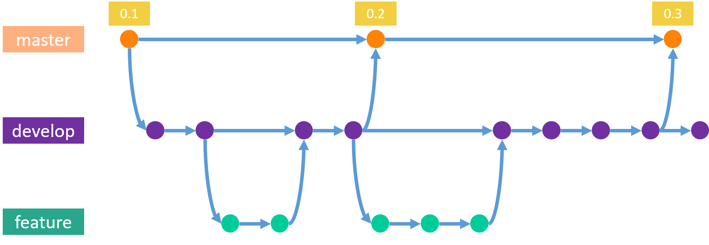

name: title
class: center, middle

# Leveraging Git

## for your development workflow

.title-logo[]

---

name: agenda

# Agenda

1. Advanced tips for daily use
  * Tooling
  * Preparing your commits<br>
    `git add`, `git commit`
  * Digging in the past <br>
    `git log`
  * Adapting Git to your needs <br>
    `git config`
  * Rewriting History <br>
    `git commit --amend`, `git rebase`
  * Don't Panic <br>
    `git reflog`

2. The bigger picture
  * Centralized Workflow
  * Feature Branches
  * GitFlow
  * Forking Workflow

3. Further pointers

---

# Tooling
## Hook your tools of choice into git

You can define the default editor via the config too:
```
$ git config --global core.editor code --wait
```
`--wait` flag is needed with VS Code, otherwise the window will close again immediately

The same goes for individual diff/merge tools:
```
$ git config --global diff.tool bc
$ git config --global difftool.bc.path "C:\Program Files\Beyond Compare 4\BComp.exe"
```

Tip: Beyond Compare lets you compare images as well

---

class: center, middle

# Tips for daily use

---

# The basics
## you probably already know
```
$ git pull
```
To sync your local repository

```
$ git add
```
To stage files for a commit

```
$ git commit
```
To commit the staged files

```
$ git push
```
To sync your changes to your main repository

.center[But Git can do __so much__ more!]

---

# Preparing your commits
## Of course there's also a layer diagram

Git knows three areas where your changes can be:

.areas[]

.addendum[The stash can be viewed as a fourth area] 

---

# Preparing your commits
## Setting up the stage

```
$ git add <file or directory>
```
To add a specific file.

```
$ git add -A
```
Adds all unstaged files, including untracked (new) ones. 

```
$ git add -i
```
Opens an interactive environment to add files.

---

# Preparing your commits
## Have full control

```
$ git add -p
```
`-p` initiates 'patch mode'. This allows you to
* Select which _parts_ of your changes you want to stage
* Review your work!


* Git slices your changes into separate 'hunks'
* You can edit them with `e`
  * If you want to exclude a line, just comment it out

```python
+def my_new_function(a, b) {
#+  a = a * 2;
+  return a + b;
+}
```

You can also partially unstage:

```
$ git reset -p
```

---

# Preparing your commits
## If that's too much fuss for you

If you want to keep it simple:
```
$ git commit -a -m "Added some stuff"
```
.addendum[Note: This does not add untracked files!]

We will shorten this later.

???

Oftentimes, it's enough to just add all files and commit them right away

---

# Digging in the past
## The log command

```
$ git log [file]
```
Shows you the commit logs, most recent at top

```
$ git log -3
```
Shows you only the 3 most recent commits

```
$ git log --after "2017-08-21" --before "2017-09-02"
```
Shows you only commits between those two dates.
Great to list commits from a specific sprint or search for a bug.

```
$ git log --author "Johnny"
```
Shows only the commits where the author contains "Johnny". Allows for Regular expressions too!

---
# Digging in the past
## More filters

```
git log --grep "JRA-1983"
```
Filters commits by their message. Very useful if you include your issue-ID in the message (which you should)
```
$ git log -L <start>,<end>:<file>
$ git log -L 42,50:MyFile.cs
```
Tracks the history of the code on line 42 - 50 in your file. Shows you e.g. how a method evolved.


---
# Digging in the past
## Comparing your branches

```
$ git log <since>..<until>
```
Allows you to show commits in a range between two _commit references_.

This is especially great to compare branches:
```
$ git log master..feature
```
Shows you the commits which are in the feature branch, but not in the master branch.

`feature..master` shows commits on master after you branched off.

---

# Digging in the past
## Formatting the output

```
$ git log --oneline
```
Shows you a much quicker summary

```
$ git log --stat
```
For each commit, list all changed files and how many lines have changed

```
$ git log --patch
```
If you want to see the whole diffs for each commit

```
$ git log --graph
```
Draws your history as the graph it really is. Looks like ASCII art.

---

# Digging in the past
## Going crazy with formatting

By combining formatting and including some _pretty_ formatting, you can get really nice outputs:
```
$ git log --graph --abbrev-commit --decorate --pretty=format:"%C(bold blue)%h%C(reset) - %C(bold green)(%ar)%C(reset) %C(white)%s%C(reset) %C(dim white)- %an%C(reset)%C(bold yellow)%d%C(reset)" --all
```

It's not quite easy to type though...

---

# Adapting Git to your needs
## Aliases

Aliases allow you to save complex commands under a simpler name.

They can save you time:

```
$ git config --global alias.co checkout
$ git config --global alias.br branch
$ git config --global alias.ci commit
$ git config --global alias.st status
```

Or nerves:
```
$ git config --global alias.gerp grep
```

Use aliases to adapt the default behaviour in a way that suits you:
```
$ git config --global alias.stash stash --include-untracked
```

.addendum[Without the `--global` flag, the alias is only applied to the current repository]

???

* There is no specific alias command in git
* You do it via git config, which updates the local or global git config (just a file .git/config)

* The stash command by default only works on unstaged and staged changes, but ignores untracked files (e.g. new ones) 

---

# Adapting Git to your needs
## Aliases for chained commands

The `!` prefix lets git execute the command in the shell. This allows you to
* chain multiple git commands
* include shell commands
* use parameters

```
$ git config alias.findBranch "!git branch | grep -i"
$ git findBranch JIRA-123
```
This helps you find the correct feature branch for an issue.

Tip: Wrap more complex commands into a shell function: 
```
[alias]
  cleanup = "!f() { git branch --merged ${1:-master} | egrep -v \"(^\\*|${1:-master})\" | xargs --no-run-if-empty git branch -d; };f"
```
This cleans up all merged branches.

???

* First snippet
  * Note that Parameters are appended to the end!
* Second snippet
  * lists all branches which are merged into a branch (argument)
  * grep to exclude the branch itself
  * then delete them
  * $n is the nth argument
  * note that $0 is the script itself
  * ${1-master} means that the default value for the first argument is "master"

---

# Adapting Git to your needs
## Aliases for providing structure

Aliases for (semantic commit messages)[https://seesparkbox.com/foundry/semantic_commit_messages] including Issue ID:
```
[alias]
feat     = "!f() { git commit -m \"$1 - feat: $2\"; }; f"
docs     = "!f() { git commit -m \"$1 - docs: $2\"; }; f"
chore    = "!f() { git commit -m \"$1 - chore: $2\"; }; f"
fix      = "!f() { git commit -m \"$1 - fix: $2\"; }; f"
refactor = "!f() { git commit -m \"$1 - refactor: $2\"; }; f"
```

```
$ git chore JRA-123 "updated build script"
[master 2ff195d] JRA-123 - chore: updated build script
```

???

Semantic commit messages:
  * Add the type of task you did to your commit messages
  * Goal: Don't mix different tasks into commits
    * E.g. bugfixes and features shouldn't be in one commit

Having the Issue Id in there is always a good idea

Could be more sophisticated of course
If one thinks this further, maybe you could parse the issue id from the feature branch

---

# Adapting Git to your needs
## Aliases for recurring tasks

```
[alias]
	cma = "!git add -A; git commit -m"
	caa = commit -a --amend -C HEAD
```

For your daily standup:
```
[alias]
	standup = "!git log --all --author=$USER --since=\"9am yesterday\" --format=%s"
```

.addendum[Source: Tim Pettersen from BitBucket]

--
```
lazy-standup = !git standup | say
```

???
* standup:
  * shows commits from all branches
  * filters by my user (just hardcode it if $USER is not supported)
  * filters only commits since the last daily
    * not the amazing datetime parsing
  * formats it to only show the subject

* lazy-standup
  * pipes the output to a speech synthesyzer (say on macos)
  * great if your working from remote!

---

# Adapting Git to your needs
## Sharing Aliases in your project

Use git of course!

Store them e.g. in a separate repository

Then link them in your local or global config via `[include]`
```
[include]
./path/to/your/repository
```

.addendum[Note: do not include random stuff - it's code you execute locally]

---

# Rewriting History
## Things can get messy

.guitar-hero[]

???
  * if your history looks like a guitar hero level on hard, then it's time to clean up

---

# Rewriting History
## Erasing your mistakes

```
$ git commit --amend 
```
_Update_ the latest commit instad of creating a new one.

Lets you update the commit message too.

```
$ git commit --amend -C HEAD
```
To keep the current message

---

# Rewriting History
## The catch

.half-width.center[]

--

```
$ git commit --amend 
```
.half-width.center[]

???

* actually copies the commits
  * also mention show reflog
* show graph with example

---

# Rewriting History
## An alternative to merging

```
$ git rebase <branch>
```

* goes to the common ancestor
* takes all commits which are not in `<branch>`
* applies them on `<branch>`

Primary reason: maintaining a __linear__ project history

Rebasing is saying

.center[ “I want to base my changes on what everybody has already done.” ]

---

# Rewriting History
## Merging example

.fixed-height-300[]

Initial state

---

# Rewriting History
## Merging example

.fixed-height-300[]

```
$ git checkout master
$ git merge feature
```
Results in a merge commit

---

# Rewriting History
## Merging example

.fixed-height-300[]

Let's try this again

---

# Rewriting History
## Rebasing example

.fixed-height-300[]

```
$ git checkout feature
$ git rebase master
```
Reapplies the change in `feature` onto `master`

---

# Rewriting History
## Rebasing example

.fixed-height-300[]

```
$ git checkout master
$ git merge feature
```
`master` can now be _fast forwarded_ to `feature` 

---

# Rewriting History
## Merging vs. Rebasing example

.center[
.fixed-height-200[]

vs

.fixed-height-200[]

]

???

TODO: The graphic in this slide is wrong
feature is at the wrong place
master would get fastforwarded to E 

* Let's say you wanted to merge master into feature first
  * to sync them
  * to be able to integrate on your branch
  * this results in a huge mess
* rebase is easy
  * it just takes what you did
  * and it applies it somewhere else
* note: you can still have merge conflicts

---

# Rewriting History
## Interactive Rebase: Refactor your history

```
$ git rebase -i HEAD~3
```

```
pick f7f3f6d JRA-123 set up basic skeleton
pick 310154e JRA-123 implemented parts of the feature
pick a5f4a0d JRA-123 added some documentation

# Rebase 710f0f8..a5f4a0d onto 710f0f8
#
# Commands:
#  p, pick = use commit
#  r, reword = use commit, but edit the commit message
#  e, edit = use commit, but stop for amending
#  s, squash = use commit, but meld into previous commit
#  f, fixup = like "squash", but discard this commit's log message
#  x, exec = run command (the rest of the line) using shell
#
# These lines can be re-ordered; they are executed from top to bottom.
#
# If you remove a line here THAT COMMIT WILL BE LOST.
#
# However, if you remove everything, the rebase will be aborted.
#
# Note that empty commits are commented out
```

???

* git hides some of its most powerful features behind just one small option
* git rebase -i HEAD~3
  * rebases HEAD~3 onto HEAD
  * just use HEAD~n if you want to edit the last n commits
  * opens an editor window
* you can edit this like a script now
* this script runs from top to bottom

---

# Rewriting History
## Interactive Rebase: Example

```
pick    f7f3f6d   JRA-123 set up basic skeleton
reword  310154e   JRA-123implemented the feeture
edit    a5f4a0d   JRA-123 added some documentation
pick    98fea92   JRA-123 started with some performance improvements
squash  21aa923   JRA-123 finished performance improvements
pick    9e18af3   JRA-123 refactored the main class
fixup   872fd88   JRA-123 fixed bug introduced during refactoring

# Rebase 710f0f8..872fd88 onto 710f0f8
#
# Commands:
#  p, pick = use commit
#  r, reword = use commit, but edit the commit message
#  e, edit = use commit, but stop for amending
#  s, squash = use commit, but meld into previous commit
#  f, fixup = like "squash", but discard this commit's log message
```

```
f7f3f6d   JRA-123 set up basic skeleton
310154e   JRA-123 implemented the feature
a5f4a0d   JRA-123 added some documentation
98fea92   JRA-123 performance improvements
9e18af3   JRA-123 refactored the main class
```

???

* Also allows you to reorder commits!

---

# Rewriting History
## The history is written by winners

Changing your log is actually encouraged!

Git offers powerful tools to do so:
  * `git commit --amend`
  * `git rebase`
  * `git rebase -i`

This allows you to get rid of all those _"added comment"_, _"fixed typo"_, _"stylecop"_ commits

Important: only update the history of your __private__ branches

???

Git offers powerful tools to do so:
  * Amending commits with `git commit --amend`
  * Rebasing your branch onto another one with `git rebase`
  * Shaping your history with `git rebase -i`

Get rid of all the clutter in your history
This makes it easier to
  * understand your projects history
  * undo features
  * find bugs

---

# Don't Panic!
## Git never forgets

Git makes sure that **anything you committed is safe**

1. A commit is defined and adressed by its hash
2. Commits are readonly, any change results in a _new_ commit with a _new_ hash
3. Commits can be unreachable by any HEAD, but still exist in the repository

There are few destructive commands:

* `git reset --hard`
* `git checkout`

---

# Don't Panic!
## Reflog

The **Reflog** is a log of all operations perfomed in a repository

```
$ git reflog

8229a31 (HEAD -> master) HEAD@{0}: reset: moving to HEAD
8229a31 (HEAD -> master) HEAD@{1}: reset: moving to 8229a315714b7856bc
b071e14 HEAD@{2}: commit: foo
8229a31 (HEAD -> master) HEAD@{3}: reset: moving to 8229a315714b7856bc
0a6aeb8 HEAD@{4}: commit (amend): Added basic todolist implementation
0b335c1 HEAD@{14}: commit: Implement add todos in the store
176c878 HEAD@{15}: commit: Enable redux devtools extension
c19e48e HEAD@{16}: commit: Add basic store setup
a9d1ae8 HEAD@{17}: commit: Basic components setup
a26f277 HEAD@{18}: commit: Remove unneeded code
c3f1332 HEAD@{19}: commit (initial): Initialize project using Create React App
```

It logs the commit in which the operation _ended_ in, so you can reset to it anytime:

```
git reset ff6a66c
```

---

class: center, middle

# The bigger picture

---

# Centralized Workflow
## A good start

Git can be used similar to a centralized VCS:
* One central repository
* Only one development branch `master`
* Devs clone the central repository
* They make local commits etc.
* Changes are rebased onto `origin/master`, then pushed

To keep history linear, always pull with
```
$ git pull --rebase origin master
```
.addendum[You want to "add your changes to what they already did"]

---

# Centralized Workflow
## Example

.full-width[]

???
initial state, we just cloned the central repository
repository has only a master branch
---

# Centralized Workflow
## Example

.full-width[]

???
Some work was done on the master in the central repository
We fetched those, they are reflected on origin/master

meanwhile, we also did some local work ourselves
---

# Centralized Workflow
## Example

.full-width[]

???
instead of merging into origin/master, we rebase our work on it.

the last two steps can be achieved with `git pull --rebase`

---

# Centralized Workflow
## Example

.full-width[]

???
when we push, master will be fast forwarded

---

# Centralized Workflow
## Conclusion

Ideal for teams coming from a centralized VCS
* Requires only a handful of commands
* Only one main branch (or _trunk_)
* Results in a linear history

Advantages over SVN/TFS:
* Every developer has his own local copy of the project
* Profit from Git's robust branching and merging model

---

# Feature Branches
## Streamline communication between developers

Feature development only on dedicated branches instead of the master
  * Feature branches can be pushed anytime

When a feature is done, create a _Pull Request_
  * Like _"Please pull my changes into master"_

Only when reviewed and accepted, merge it into master

<br>
__Pull Requests__:
  * Not a Git feature per se
  * Use Gerrit, Bitbucket, Github etc.

???

Feature branches are the logical next step

One of the most important workflows

Feature branches can be pushed anytime
  * so you get a backup for free
  * makes it easy to share code

Pull requests make code reviews convenient
  * you can look at the feature as a whole (by diffing it to `master`)
  * anybody, e.g. the reviewer, can merge it when done, not only the dev who created it

---

# Feature Branches
## Example

.full-width[]

???

no separate client/server view, because the repository can be synced at any time

---

# Feature Branches
## Example

.full-width[]

---

# Feature Branches
## Example

.full-width[]

Feature branch is _merged_ into `master`

---

# Feature Branches
## Example

.full-width[]

Alternatively: Feature branch is _rebased_ onto `master`

???

Pro: You have a more linear history on master
Contra: You have more commits on master, can't revert features as easily

---

# Feature Branches
## Conclusion

Feature branches offer lots of benefits:
  * Work on features never disturbes the main code base
  * `master` never contains broken or unfinished features
  * Easy to work on two features in parallel
  * Sharing WIP features without touching the official code base
  * Allow for pull requests, which are great for code reviews

Tip: Use descriptive names incl. issue number
E.g. JRA-123-log-out-function

Protip: Use your CI infrastructure to build and test feature branches too.

---

# GitFlow
## A way to make modern software development manageable

A strict branching model created by [Vincent Driessen](http://nvie.com/posts/a-successful-git-branching-model/)
* Designed around releases
* No new concepts or commands 
* Robust for managing larger projects

---

# GitFlow
## Example

.full-width[]

Two eternal branches:
* __`master`__: The 'official' release history
  * Contains only merge commits
  * Each commit is tagged with a version
  
* __`develop`__: Integration branch for features
  

???

* You could deploy the current release at any time from master
* You'd had a nightly build on develop

---

# GitFlow
## Example

.full-width[]

Development happens in __feature branches__ off `develop`.

Merge back into `develop` with
```
$ git checkout develop
$ git merge --no-ff myFeature
```

???

The interaction between develop and feature branches is just the feature branches workflow described before
Note: Feature branches can also 'skip' a version, no problem

The no-ff part is critizised by some, rebasing is an alternative

---

# GitFlow
## Example

.full-width[]

When a release is approaching, a __release branch__ is created
  * Only bugfixing and documentation is done on there
  * When done, merge release into `master` and back into `develop`

???

* Once develop has acquired enough features for a release you fork a release branch
* branch is for stabilizing the release, make it ready, without development interfering
* Of course you can (or even should) develop bugfixes in their own feature branches
* makes it possible for one team to polish the current release while another works on new features
---

# GitFlow
## Example

.full-width[]

__Hotfix__ branches off `master` to patch production releases
  * Once done, it is merged into `master` and `develop`

???
* similar to a release branch for master
* this way, urgent fixes do not block development
* no need to wait for the next release cycle

---

# GitFlow
## Conclusion
Very strict and robust, but can be hard to follow.

Can be more complex than you need
  * E.g. master branch is kinda redundant
  * History tends to become very complicated

Feel free to tailor it to _your_ project

.full-width[]

???
Don't be afraid to adopt some aspects of the workflow and disregard others

E.g. the master branch is kinda redundant, if you don't need to build from it you can also tag `develop`

---

# Forking Workflow

## Going fully distributed

On a developer level .addendum[(the Open Source approach)]

* Every developer has his own server-side repository
* _Only_ project maintainer can push to the official repository

On a supplier level

* Project team works on the official repository
* Suppliers have their forks, no write-access to offical repository
* Project team pulls work from suppliers after reviewing them

.fixed-height-300.center[]

???

* allows maintainer to accept commits from any developer without giving them write access to the official codebase

 
---

# The bigger picture
## Conclusion

Git allows for a variety of Workflows

There is no one-size-fits-all

Think about what fits _your_ team and project

---

class: center, middle

# Further pointers

---
# Further pointers
## Just a dump of some more stuff

`git rerere`
  * lets you record changes you made during merges and applies them automatically the next time

`git filter-branch`
  * lets you scrub the entire history
  * useful if you e.g. want to
    * remove a file from the entire history
    * change an authors email adress globally 

Git LFS
  * An extension for versioning large files
  * If you need to store huge assets in your repository

???

* git rerere
  * useful if you rebase a lot
* filter-branch
  * be cautios with that
* git lfs
  * replaces files with text pointers and stores the file contents on a remote server
  * e.g. large files such as audio samples, videos, datasets, and graphic
  * also huge data sets in data science

---

# Links
* Official Website: https://git-scm.com
* Interactive branching tutorial & sandbox: http://learngitbranching.js.org
* Another interactive branching sandbox: http://git-school.github.io/visualizing-git/
* A Visual Git Reference: https://marklodato.github.io/visual-git-guide/index-en.html

---

# Sources

* Git Logo by [Jason Long](https://twitter.com/jasonlong) is licensed under the [Creative Commons Attribution 3.0 Unported License](https://creativecommons.org/licenses/by/3.0/).
* [Stack Overflow Developer Survey Results 2017](https://insights.stackoverflow.com/survey/2017#overview)
* [Tips and Tricks: Gotta Git Them All - GitHub Universe 2016](https://www.youtube.com/watch?v=LsxDxL4PYik)
* [Git Aliases of the Gods! - Git Merge 2017](https://www.youtube.com/watch?v=3IIaOj1Lhb0)
* [Atlassian Git Tutorials](https://www.atlassian.com/git/tutorials)